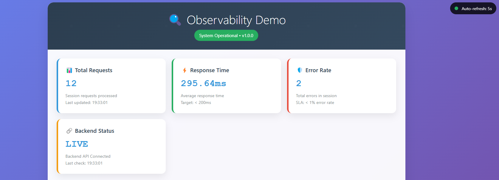
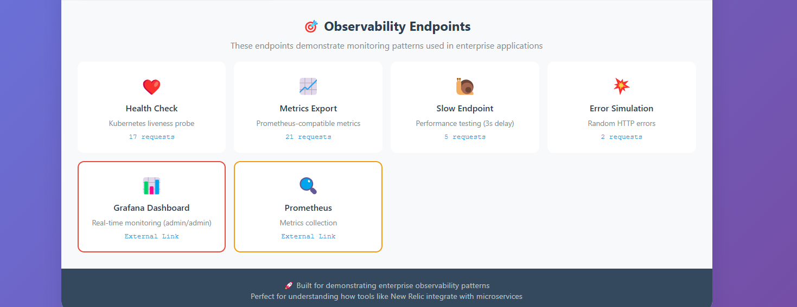
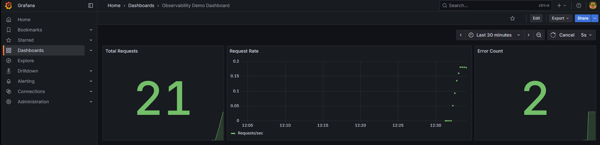

# Enterprise Observability Demo - Complete Monitoring Stack

> **A production-ready demonstration of modern observability patterns with containerized microservices, real-time monitoring dashboards, and automated traffic generation.**

[](https://docker.com)
[](https://prometheus.io)
[](https://grafana.com)
[](https://flask.palletsprojects.com)

## What This Demonstrates

This project showcases **enterprise-grade observability patterns** used in production environments - perfect for understanding how tools like **New Relic**, **DataDog**, or **Prometheus** integrate with real applications.

### **Modern Architecture**
- **Microservices** with service-to-service communication
- **Health check endpoints** for Kubernetes probes  
- **Containerized deployment** with Docker Compose
- **Database integration** for metrics persistence

### **Complete Monitoring Stack**
- **Prometheus** - Time-series metrics collection
- **Grafana** - Professional dashboards and visualization
- **PostgreSQL** - Metrics storage and analysis
- **Real-time metrics** flowing from application to monitoring platform

### **Professional Web Interface**
- **Modern responsive design** with auto-refreshing dashboards
- **Real-time performance metrics** and system health monitoring
- **Interactive testing endpoints** for demonstration purposes
- **Background traffic generation** creating realistic monitoring scenarios

---

## Screenshots

### Main Observability Dashboard
*Modern web interface with real-time metrics and auto-refresh functionality*



**Features shown:**
- Real-time metrics: 12 total requests, 295.64ms avg response time
- Auto-refresh every 5 seconds with live indicator
- Error tracking: 2 errors detected
- Backend connectivity status: LIVE
- Professional modern UI with color-coded metric cards

### Interactive Observability Endpoints
*Testing endpoints that demonstrate enterprise monitoring patterns*



**Demonstrates:**
- Health Check endpoint (17 requests) - Kubernetes liveness probes
- Metrics Export (21 requests) - Prometheus integration points
- Slow Endpoint (5 requests) - Performance bottleneck simulation
- Error Simulation (2 requests) - Error rate testing
- External links to Grafana and Prometheus dashboards

### Grafana Professional Dashboards  
*Enterprise-grade monitoring with real-time charts and metrics*



**Shows:**
- Live metrics collection: 21 total requests tracked
- Request rate visualization: ~0.2 requests/sec
- Error count monitoring: 2 errors detected
- Professional dark theme interface
- Time-series data visualization over 30-minute window

---

##  Quick Start (5 Minutes)

### Prerequisites
- **Docker Desktop** with Docker Compose
- **8GB RAM** recommended for full stack
- **Ports available:** 3000, 5432, 8080, 9090

### 1. Clone and Start
```bash
git clone https://github.com/dandeppert/observability-demo.git
cd observability-demo

# Start the complete stack
docker-compose up --build
```

### 2. Access Your Observability Stack
| Service | URL | Credentials | Purpose |
|---------|-----|-------------|---------|
| ** Main Demo** | http://localhost:8080 | - | **Modern observability dashboard** |
| ** Grafana** | http://localhost:3000 | admin / admin | **Professional monitoring dashboards** |
| ** Prometheus** | http://localhost:9090 | - | **Time-series metrics collection** |
| ** Database** | localhost:5432 | postgres / password | **Metrics storage** |

### 3. Watch It Work! 
**Automatic traffic generation** starts immediately  
**Real-time metrics** update every 5 seconds  
**Professional dashboards** show live performance data  
**Background load** creates realistic monitoring scenarios  

---

## Demo Features

### **Real-Time Monitoring**
- **Auto-refreshing dashboard** with live metrics
- **Performance indicators** showing request counts, response times, error rates
- **Health monitoring** with service status indicators
- **Background traffic generation** creating realistic scenarios

### **Testing Endpoints**
| Endpoint | Purpose | Demo Value |
|----------|---------|------------|
| `/` | Main dashboard with metrics | Shows real-time application performance |
| `/health` | Kubernetes health checks | Demonstrates infrastructure monitoring |
| `/metrics` | Prometheus-compatible metrics | Shows APM tool integration points |
| `/slow` | Performance testing (3s delay) | Simulates performance bottlenecks |
| `/error` | Random error generation | Demonstrates error tracking and alerting |

### **Professional Dashboards**
- **Grafana dashboards** with live charts and graphs
- **Prometheus metrics** collection and storage
- **Database analytics** with performance tracking
- **Alert configuration** and notification setup

---

## Architecture Overview

```
┌─────────────────────────────────────────────────────────────┐
│                    Observability Stack                      │
├─────────────────────────────────────────────────────────────┤
│  Frontend (Flask)  ◄────────► Backend (Flask)              │
│       :8080                        :5001                    │
│         │                            │                     │
│         ▼                            ▼                     │
│  ┌─────────────┐              ┌─────────────┐              │
│  │ Prometheus  │◄─────────────┤   Grafana   │              │
│  │   :9090     │              │    :3000    │              │
│  └─────────────┘              └─────────────┘              │
│         │                            │                     │
│         ▼                            ▼                     │
│  [ Metrics Storage ]          [ Visual Dashboards ]        │
│                                                             │
│  PostgreSQL Database ──► Metrics Persistence               │
│  Background Load Gen ──► Continuous Traffic                │
└─────────────────────────────────────────────────────────────┘
```

### **Data Flow**
1. **Application** generates metrics and logs
2. **Prometheus** scrapes metrics every 5 seconds
3. **Grafana** visualizes data with professional dashboards
4. **PostgreSQL** stores metrics for analysis
5. **Load generator** creates realistic traffic patterns
6. **Health checks** monitor service availability

---

## Technical Implementation

### **Frontend Service**
- **Flask** web framework with modern responsive UI
- **Real-time metrics** collection and display
- **Background traffic generation** for realistic scenarios
- **Database integration** for metrics persistence

### **Backend Service** 
- **REST API** with Prometheus-compatible metrics endpoint
- **Health monitoring** and service discovery
- **Error simulation** and performance testing
- **Proper metrics format** (text/plain for Prometheus)

### **Monitoring Stack**
- **Prometheus** for time-series metrics collection
- **Grafana** for dashboard visualization and alerting
- **PostgreSQL** for metrics storage and analysis
- **Docker Compose** for container orchestration

### **Key Technologies**
- **Docker & Docker Compose** - Container orchestration
- **Python/Flask** - Web framework and API development
- **Prometheus** - Metrics collection and monitoring
- **Grafana** - Dashboard creation and visualization
- **PostgreSQL** - Database and metrics storage
- **HTML/CSS/JavaScript** - Modern web interface

---

## Perfect for Technical Interviews

### **Sales Engineering Value**
- **"Let me show you my observability demo..."**
- **Real monitoring dashboards** with live data flowing
- **Performance testing scenarios** with actual bottlenecks
- **Enterprise architecture patterns** that customers use

### **What Interviewers Will See**
- **Deep technical understanding** of monitoring challenges
- **Hands-on experience** with observability tools
- **Real-world integration patterns** for APM solutions
- **Professional presentation** of complex technical concepts

### **Discussion Points**
- How observability tools integrate with customer applications
- Common monitoring challenges in microservices architectures  
- Performance optimization and troubleshooting approaches
- ROI demonstration through monitoring and alerting

---

## Testing and Demonstration

### **Performance Testing**
```bash
# Test slow performance scenarios
curl http://localhost:8080/slow

# Generate error conditions
curl http://localhost:8080/error

# Check service health
curl http://localhost:8080/health

# View Prometheus metrics
curl http://localhost:8080/metrics
```

### **Load Testing**
```bash
# Generate sustained traffic
for i in {1..10}; do
  curl http://localhost:8080/ &
  curl http://localhost:8080/slow &
  curl http://localhost:8080/error &
done
```

---

## Development and Customization

### **Project Structure**
```
observability-demo/
├── docker-compose.yml           # Container orchestration
├── frontend/                    # Web application
│   ├── app.py                  # Flask application with modern UI
│   ├── Dockerfile              # Container configuration
│   └── requirements.txt        # Python dependencies
├── backend/                     # API service
│   ├── app.py                  # Flask API with metrics
│   ├── Dockerfile              # Container configuration
│   └── requirements.txt        # Python dependencies
├── monitoring/                  # Monitoring configuration
│   ├── prometheus.yml          # Prometheus configuration
│   └── grafana/                # Grafana dashboards
└── screenshots/                # Demo screenshots
```

### **Extending the Demo**
- **Add more microservices** to show service mesh patterns
- **Implement distributed tracing** with Jaeger
- **Add log aggregation** with ELK stack
- **Include chaos engineering** scenarios
- **Integrate APM agents** (New Relic, DataDog, etc.)

---

## Troubleshooting

### **Common Issues**

**Frontend shows "Server is up and running"**
- Verify you're using the enhanced frontend code
- Check Docker build is using the correct files
- Rebuild with `docker-compose build --no-cache frontend`

**Prometheus targets show DOWN**
- Check container networking with `docker-compose logs prometheus`
- Verify backend metrics endpoint returns `text/plain` format
- Ensure services are accessible within Docker network

**Grafana shows no data**
- Wait 2-3 minutes for services to fully start
- Check Prometheus is collecting metrics at `/targets`
- Verify datasource configuration in Grafana

**Database connection errors**
- Ensure PostgreSQL container is healthy
- Check database credentials in environment variables
- Wait for database initialization to complete

### **Reset Everything**
```bash
# Complete cleanup and restart
docker-compose down -v
docker system prune -f
docker-compose up --build
```

---

## Contributing

This project demonstrates enterprise observability patterns and is perfect for:

- **Adding monitoring tools** (APM agents, log aggregators)
- **Creating additional dashboards** (business metrics, SLO tracking)  
- **Implementing chaos scenarios** (failure injection, load testing)
- **Documentation improvements** (deployment guides, troubleshooting)

### **Development Setup**
```bash
# Local development
git clone https://github.com/dandeppert/observability-demo.git
cd observability-demo

# Start development stack
docker-compose up --build

# Make changes and test
docker-compose restart frontend
```

---

## License

MIT License - Feel free to use for learning, training, demonstrations, or building your own observability solutions.

---

## About This Project

Built by **Dan Deppert** as a demonstration of enterprise observability patterns and monitoring integration for technical interviews and customer demonstrations.

**Connect with me:**
- **LinkedIn:** [linkedin.com/in/dandeppert](https://linkedin.com/in/dandeppert)
- **Portfolio:** [dandeppert.com](https://dandeppert.com)

---

**Perfect for technical interviews, customer demonstrations, training sessions, and learning modern observability patterns.**

*This demo showcases the exact infrastructure challenges that enterprise monitoring tools solve in production environments.*
